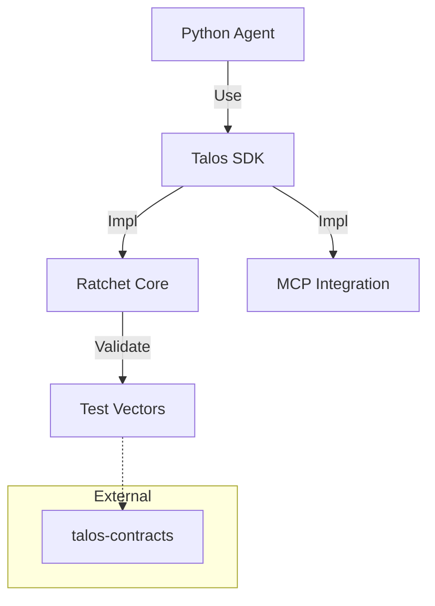

# Talos SDK for Python

**Repo Role**: Reference implementation of the Talos Protocol for Python-based agents. Provides high-level secure transport primitives.

## Abstract
The Talos SDK for Python creates a secure, encrypted tunnel for Model Context Protocol (MCP) interactions. It implements the Double Ratchet Algorithm to ensure confidentiality and integrity for autonomous agents, adhering strictly to the `talos-contracts` specification.

## Introduction
Building secure agents requires more than standard TLS. `talos-sdk-py` provides an application-layer security protocol that binds identity to Ed25519 keys, manages session state, and handles asynchronous messaging, allowing Python agents to communicate securely over any untrusted transport.

## System Architecture



This SDK is a consumer of `talos-contracts` and a peer to the TS/Java/Go SDKs.

## Technical Design
### Modules
- **talos_sdk.core**: Double Ratchet implementation.
- **talos_sdk.mcp**: MCP transport adapters.
- **talos_sdk.crypto**: Cryptographic primitives (using `cryptography` lib).

### Data Formats
- **Input**: MCP JSON-RPC messages.
- **Output**: Encrypted, signed Talos Envelopes.

## Evaluation
**Status**: Production Ready (v1.1.0).
- **Conformance**: 100% pass rate on `v1.1.0` release set.
- **Interop**: Verified against TypeScript and Java SDKs.

## Usage
### Quickstart
```bash
pip install talos-sdk-py
```

### Common Workflows
1.  **Initialize Session**:
    ```python
    from talos_sdk import Session
    session = Session.create(identity_key)
    ```
2.  **Send Message**:
    ```python
    ciphertext = session.encrypt(plaintext)
    ```

## Operational Interface
*   `make test`: Run unit tests (`pytest`).
*   `make conformance`: Run vector tests against `talos-contracts`.
*   `scripts/test.sh`: CI entrypoint.

## Security Considerations
*   **Threat Model**: Passive interception, active tampering, key compromise.
*   **Guarantees**:
    *   **PFS**: Compromise of current keys does not reveal past conversation.
    *   **Auth**: Only holders of the identity key can sign messages.

## References
1.  [Mathematical Security Proof](../talos-docs/Mathematical_Security_Proof.md)
2.  [Talos Contracts](../talos-contracts/README.md)
